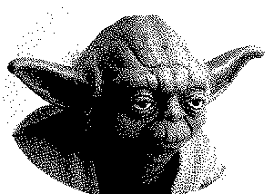

# bookmarklets

---

## [Hooktube](./hooktube)

## [Only.You](./only.you)

Personally I prefer to focus on some I'm currently doing. This is also about viewing videos on [YouTube](https://www.youtube.com/). 
The problem is that there are many, many visual distractions around it: similar or recommended videos, control elements, comments. 
At best, they can interfere with working concentration, and at worst, they can waste time. Current bookmarklet is an attempt to deal with this. :dart:

## [Remove.Images](./remove.images)

## [Unhide.Elements](./unhide.elements)

## [Yodify](./yodify)

This fun bookmarklet allows you to translate the so-called "normal" speech in **Russian**/**Ukrainian**/**English** to Yoda's language. 
Just select an original language and enter some.

## Contributing

Pull requests with your own favorite bookmarklets are highly welcome.
